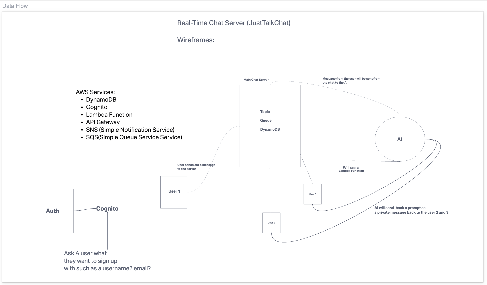

# just-talk-chat

 The "JustTalkChat" platform, hosted on AWS, redefines real-time group chatting by integrating an AI-driven feature that offers reply suggestions to participants. When a message is posted in a group chat, the AI privately asks other users if they'd like pre-written response options. If they agree, these suggestions are sent in a private chat, streamlining the process of replying in the group. This innovation makes JustTalkChat a convenient and interactive solution for both casual and professional communication.

## Links:
- [TRELLO](https://trello.com/invite/b/uxaSmWNf/ATTIbc7032965c8252ccaf74a03c4c7b28fb7EEEA6C2/just-talk-chat)

## Domein Modeling

## Database Schema Diagram

## Contributors:
- Ekaterina Khoroshilova
- Adnan Mohamud
- David Danilchik
