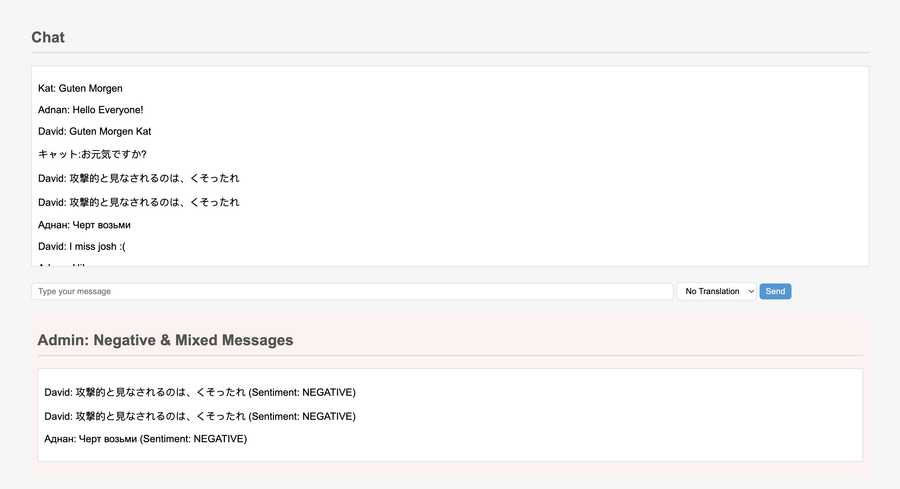
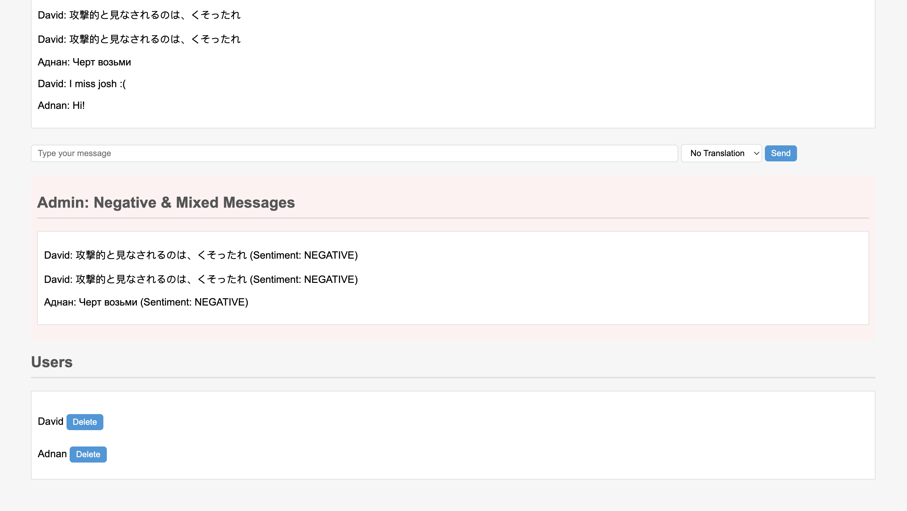
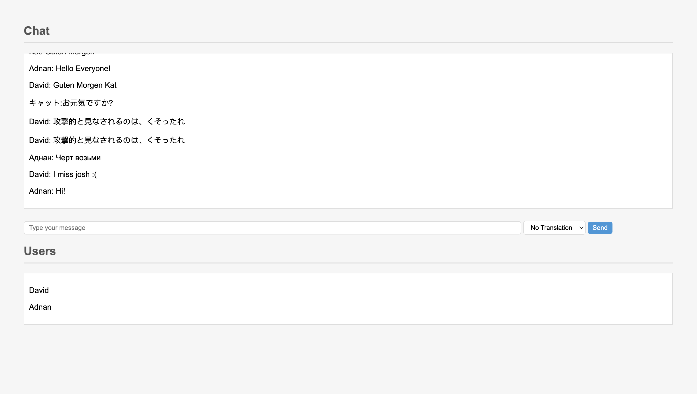

# just-talk-chat

Our application offers a dynamic chat room where users from around the world can engage in real-time conversations. With our built-in translation feature, users can effortlessly communicate across languages, breaking down linguistic barriers and fostering global connections. Leveraging advanced AI, the platform proactively filters and identifies toxic messages, ensuring a positive communication environment. For enhanced moderation, administrators are granted access to a private chatroom, where they can review all flagged toxic content. This unique combination of features makes our platform both user-friendly, secure, and globally accessible.

## Admin View

 

## User View



## Technologies Used

- AWS Lambda
- API Gateway
- AWS DynamoDB
- Amazon Comprehend
- Amazon Translate
- HTML
- JavaScript
- Node.js
- Fetch API
- JSON
- Trello
- InVision
- GitHub

## Usage

### **1. Get All Chat Users**
- **Endpoint**: `/chat`
- **Method**: `GET`
- **Response**:
\```json
{
  "statusCode": 200,
  "body": {
    "users": [
      {
        "Admin": true,
        "UserID": 1,
        "Username": "Username"
      }
    ]
  }
}
\```

### **2. Delete User by ID**
- **Endpoint**: `/chat/{id+}`
- **Method**: `DELETE`
- **Response**:
\```json
{
  "message": "User deleted successfully"
}
\```

### **3. Get Messages by Group ID**
- **Endpoint**: `/chat/{id+}`
- **Method**: `GET`
- **Response**:
\```json
{
  "messages": [
    {
      "Timestamp": "2023-10-20T16:27:27.270Z",
      "Sentiment": "POSITIVE",
      "TranslatedContent": "Translated message content",
      "MessageId": "unique-message-id",
      "Content": "Message content",
      "Sender": 1,
      "GroupChatId": "group1"
    }
  ]
}
\```

### **4. Post Message to a Group**
- **Endpoint**: `/chat/{id+}`
- **Method**: `POST`
- **Request**:
\```json
{
  "content": "Hi!",
  "GroupChatId": "group1",
  "TranslateTo": null
}
\```
- **Response**:
\```json
{
  "message": "Message sent to the group chat."
}
\```

## Links:
- [TRELLO](https://trello.com/invite/b/uxaSmWNf/ATTIbc7032965c8252ccaf74a03c4c7b28fb7EEEA6C2/just-talk-chat)

## Domein Modeling


## Database Schema Diagram


## Contributors:
- Ekaterina Khoroshilova
- Adnan Mohamud
- David Danilchik
