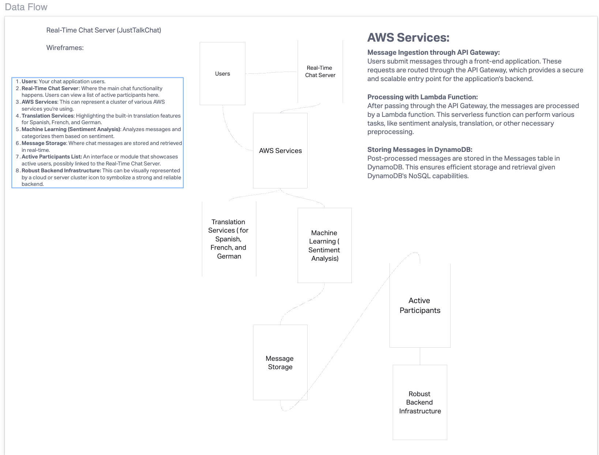
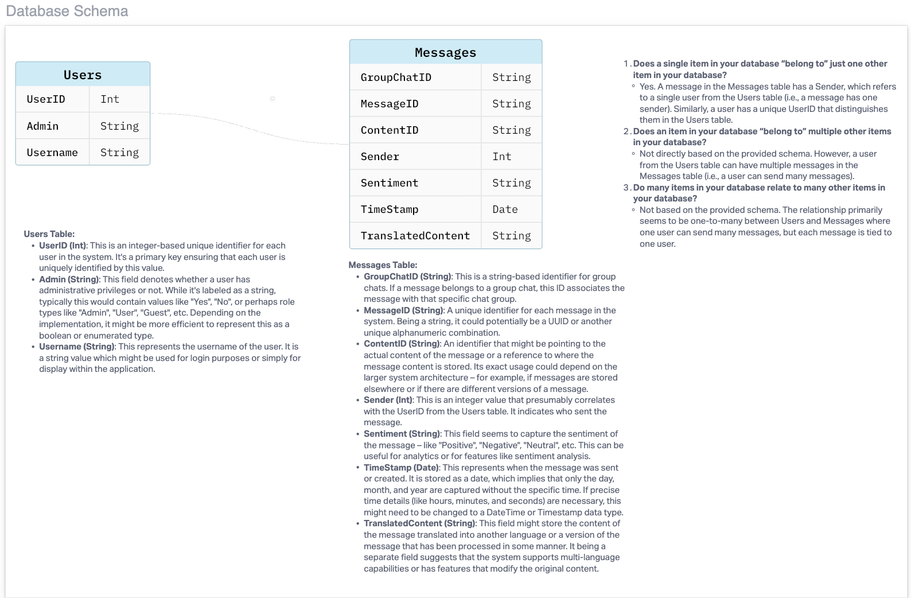

# just-talk-chat

Our application offers a dynamic chat room where users engage in real-time conversations. Leveraging AI, the platform proactively filters and identifies toxic messages, ensuring a positive communication environment. For enhanced moderation, administrators are granted access to a private chatroom, where they can review all flagged toxic content, making our platform both user-friendly and secure.

## Links:
- [TRELLO](https://trello.com/invite/b/uxaSmWNf/ATTIbc7032965c8252ccaf74a03c4c7b28fb7EEEA6C2/just-talk-chat)

## Domein Modeling

## Database Schema Diagram

## Contributors:
- Ekaterina Khoroshilova
- Adnan Mohamud
- David Danilchik
