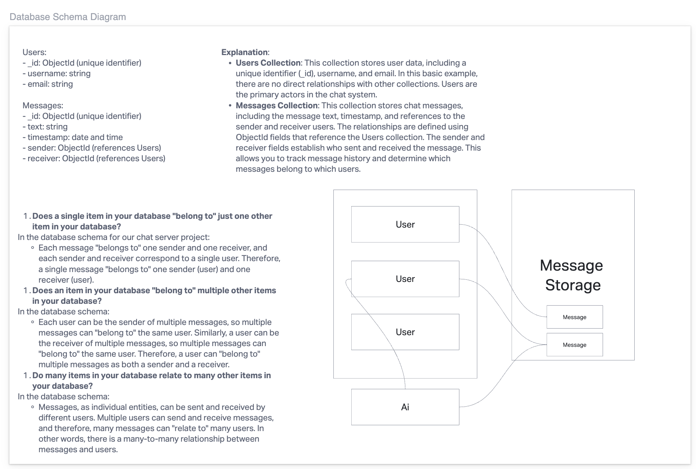

# just-talk-chat
- An application where users can send and receive messages, and possibly host private chats/DM's. Possibly have Ai contribute to chats by making chat/response sugestions for users.

## Links:
- [TRELLO](https://trello.com/invite/b/uxaSmWNf/ATTIbc7032965c8252ccaf74a03c4c7b28fb7EEEA6C2/just-talk-chat)

## Domein Modeling

## Database Schema Diagram

## Contributors:
- Ekaterina Khoroshilova
- Adnan Mohamud
- David Danilchik
